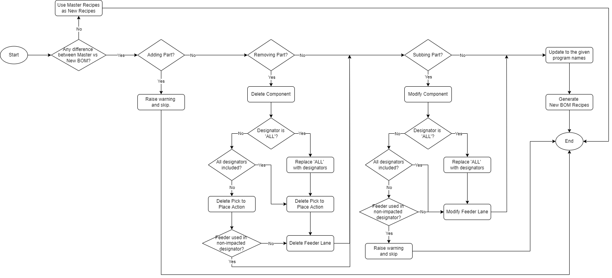

# BOM_PROGRAM_CREATE
To automate BOM program creation, generated based on master BOM program. Developed by [jiajunlee](https://github.com/jiajunlee19).

 

 

### Installation
- Fork this project [here](https://github.com/jiajunlee19/bom-program-create-app/fork)
  
    OR
   
- Clone this project by `git clone "https://github.com/jiajunlee19/bom-program-create-app.git"`
  
    OR
   
- Download this project in zip [here](https://github.com/jiajunlee19/bom-program-create-app/archive/refs/heads/master.zip) and extract

 

### How to run?
0. (Optional) Go to `settings` sheet in [BOM.xlsx](BOM.xlsx), modify the settings if needed.
1. Go to `BOM` sheet in [BOM.xlsx](BOM.xlsx), fill in master and new BOM info accordingly.
2. (For SAP_SOURCE = `manual` selected in step `#0` only): Place all relevant BOM and MCTO files in `BOM_590` folder and `MCTO` folder.
    - The provided files must be in `.csv` format exported from `SAP`.
    - For MCTO, the files must be named as `MCTO`_`PV` (eg: `705043_1.csv`)
3. Place all relevant bom recipes in `recipe-bom-master` folder.
4. Run [main.exe](main.exe).
5. Created new BOM recipes can be found in `recipe-bom-new` folder within subfolder grouped by `BOM_MCTO_PV`.
6. (Optional): View the BOM differences detail in `SCRIPT_OUTPUT.xlsx` by subfolder in `recipe-bom-new`.
7. (Optional): View the logs in [Log/BOM_PROGRAM_CREATE.log](Log/BOM_PROGRAM_CREATE.log).

 

### Limitations
Below are the limitations that cannot be handled. Warning will be raised as such the impacted line item will be skipped.
1. `Part Extra Place` or `Adding Part` cannot be handled.
2. `Part Sub` or `Subbing Part` with feeder used in any non-impacted designator cannot be handled.

 

### Test Cases
Below are the passing test cases, using [590-624661](BOM_590/590-624661.csv) as Master BOM.
References: [BOM_590](BOM_590/) and [recipe-bom-new](recipe-bom-new/)

| New BOM                              | Differences from Master BOM | Result                                                   |
| :---                                 | :-------------------------  | :----                                                    |
| [590-624662](BOM_590/590-624662.csv) | No differences              | Generated new recipes, exactly same with master recipes. |
| [590-624663](BOM_590/590-624663.csv) | Adding Part (R1000,R2000) into 510-500881              | No new recipes generated as per limitation `#1`          |
| [590-624664](BOM_590/590-624664.csv) | Removing All Part from 510-500881                | Generated new recipes as expected.                       |
| [590-624665](BOM_590/590-624665.csv) | Removing Partial Part (R69,R91,R107,R112-R113) from 510-500881              | Generated new recipes as expected.                       |
| [590-624666](BOM_590/590-624666.csv) | Subbing All Part from 510-500881 to 510-500882              | Generated new recipes as expected.                       |
| [590-624667](BOM_590/590-624667.csv) | Subbing Partial Part (R69,R91,R107,R112-R113,R120) from 510-500881 to 510-500882              | No new recipes generated as per limitation `#2`          |

 

### Details
Here are some details if you are interested on how the `.pp` or `.pp7` are modified and being generated into `recipe-bom-new`.

0. Master BOM and New BOM Info
     
    
     
    

 

1. Part Removal - Delete Component
     
    

 

2. Part Removal - Delete Feeder
     
    

 

3. Part Removal - Delete Pick to Place
    * For pp
         
        
         
    * For pp7
         
        

 

4. Part Sub - Modify Component
     
    

 

5. Part Sub - Modify Feeder
     
    

 

6. Generated New BOM Recipes
     
    

 